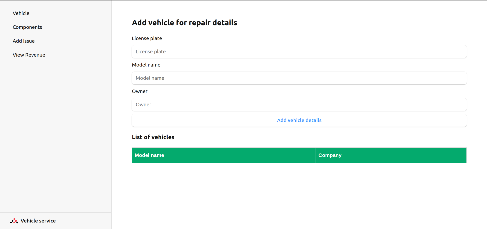

# Vehicle Service System (React)

This is a React application for managing vehicle services. The application interacts with a Django backend to handle data related to vehicles, components, and issues.

## Prerequisites

Before you begin, ensure you have the following installed on your machine:

- Node.js
- npm or yarn
- Django backend `https://github.com/muraliktg99/vehicle-service-system.git`

## Frontend Setup (React)
1. Setup and Run the Django Backend initially
1. **Clone the repository**:
    ```sh
    git clone https://github.com/muraliktg99/vehicle-service-system-frontend.git

    cd vehicle-service
    ```

2. **Install the required packages**:
    ```sh
    npm install
    # or
    yarn install
    ```

3. **Run the React development server**:
    ```sh
    npm run dev
    # or
    yarn run dev
    ```

## Project Structure

- **src**: Contains the source code for the React application.
- **public**: Contains the public assets and the HTML template.

## Key Features

- **Vehicle Management**: Add vehicle details.
- **Component Management**: Add vehicle components.
- **Issue Tracking**: Track issues related to vehicles and components.

